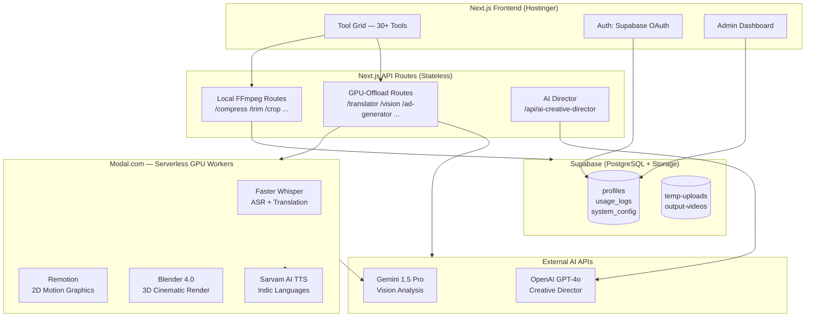

# Module31 — Privacy-First Media Processing Platform

> **30+ professional video and audio tools. Zero permanent file storage. Pay only for what you use.**

Module31 is an enterprise-grade, privacy-first media SaaS platform built for content creators and marketing teams. It consolidates tools that usually require 7+ separate subscriptions into a single, credit-based platform — with AI-powered capabilities layered on top.

---

## The Problem

Content creators and marketing teams juggle **7+ separate tools** to accomplish basic media workflows:
- Compress a video → one tool
- Add subtitles → another tool
- Translate audio → another tool
- Generate an ad → yet another tool

Each tool stores files **permanently** on third-party servers. Each charges a **monthly subscription** for features used twice a month. There is no unified, privacy-respecting alternative.

**Module31 solves this.** One platform. No permanent file storage. Credit-based pricing.

---

## Platform Capabilities

### Standard Media Tools (FFmpeg-powered, browser-to-server)
| Tool | What It Does |
|---|---|
| Compress | Reduce video size by up to 80% with quality control |
| Quick Trim | Cut video to precise timestamps |
| Social Crop | Auto-crop to 9:16 for Reels/Shorts/TikTok |
| Video to GIF | Convert any clip to an optimized GIF |
| Format Converter | MP4 ↔ MOV ↔ AVI ↔ WebM |
| Extract Audio | Pull MP3/WAV from any video |
| Audio Normalizer | Standardize loudness across clips |
| Hardcoded Subtitles | Burn captions directly into video |
| Video Concatenator | Join multiple clips seamlessly |
| Thumbnail Generator | Extract frame as high-res image |
| Speed Master | Slow motion or time-lapse |
| Resolution Scaler | Upscale or downscale to any target |
| Frame Rate Converter | 24fps ↔ 30fps ↔ 60fps |
| Metadata Stripper | Remove all embedded file metadata |
| Flip / Rotate | Mirror or rotate any video |
| Visual Adjustments | Brightness, contrast, saturation |
| Audio Waveform | Generate audio visualizer video |
| Audio Remover | Mute video completely |

### AI-Powered Tools (GPU Workers on Modal.com)
| Tool | AI Stack | What It Does |
|---|---|---|
| Video Translator | Faster Whisper + Sarvam AI TTS | Transcribe, translate, and dub video in 30+ languages |
| Vision Agent | Gemini 1.5 Pro | Analyze video frames and generate structured insights |
| AI Ad Generator | GPT-4o + Remotion | Text prompt → motion typography video ad |
| AI Motion Artist | GPT-4o + Blender | Text prompt → cinematic 3D motion video |
| Industrial Pipeline | GPT-4o + Blender SVD | Product photo → commercial-quality video |

---

## Architecture Overview

---

## Key Product Decisions

| Decision | What We Did | Why |
|---|---|---|
| **Credit model, not subscription** | Users buy credit bundles; each tool deducts credits | Reduces friction for occasional users; no "wasted" subscription |
| **Guest trial mode** | 5 free uses with watermark before signup gate | Lets users experience value before committing — drives activation |
| **Credits deducted before GPU** | Charge before invoking Modal workers | Prevents runaway GPU spend if users spam requests |
| **Admin-driven config** | Costs, watermarks, retention stored in DB | Change pricing without code deploys — live A/B testing |
| **Modal for GPU workers** | Python serverless on NVIDIA T4 | Scales to zero; no idle GPU cost; faster than Lambda for ML |
| **FFmpeg bundled** | `ffmpeg-static` package, no system install | Consistent binary across environments; zero infrastructure dependency |
| **Dual rendering engines** | Remotion (2D) + Blender (3D) | Remotion for fast kinetic text; Blender for cinematic premium output |

---

## Product & Architecture Documentation

This repository contains the full product lifecycle documentation — from discovery to delivery.

### Product Lifecycle
| Document | Description |
|---|---|
| [Executive Summary](docs/00-lifecycle/executive-summary.md) | One-page overview: problem, solution, tech bets, outcomes |
| [Metrics & OKRs](docs/00-lifecycle/metrics-and-okrs.md) | Northstar metric, OKRs, unit economics |
| [Product Lifecycle](docs/00-lifecycle/product-lifecycle.md) | Full journey: Trigger → Discovery → Design → Build → Ship |
| [Why We Built This](docs/00-lifecycle/why-we-built-this.md) | Founding insight and market opportunity |

### Discovery
| Document | Description |
|---|---|
| [Problem Statement](docs/01-discovery/problem-statement.md) | Market pain, fragmentation, privacy gap |
| [Market Analysis](docs/01-discovery/market-analysis.md) | Competitive landscape, positioning matrix |
| [User Personas](docs/01-discovery/user-personas.md) | 3 core personas with jobs-to-be-done |

### Product
| Document | Description |
|---|---|
| [PRD](docs/02-product/prd.md) | Full Product Requirements Document with priorities |
| [Business Model](docs/02-product/business-model.md) | Guest funnel, credit economics, admin pricing control |
| [Roadmap](docs/02-product/roadmap.md) | V1 → V2 → V3 with rationale |

### Architecture
| Document | Description |
|---|---|
| [System Design](docs/03-architecture/system-design.md) | Full architecture with component breakdowns |
| [Architecture Decisions](docs/03-architecture/architecture-decisions.md) | 7 ADRs: what was chosen and why |
| [Failure Modes](docs/03-architecture/failure-modes.md) | Resilience strategy for every external dependency |
| [Data Flow](docs/03-architecture/data-flow.md) | Request lifecycle, auth paths, credit sequence |
| [Tech Stack](docs/03-architecture/tech-stack.md) | Every layer: technology → rationale → alternative considered |

### Delivery
| Document | Description |
|---|---|
| [Build Approach](docs/04-delivery/build-approach.md) | How 30+ tools were shipped solo and systematically |
| [Lessons Learned](docs/04-delivery/lessons-learned.md) | What worked, what was hard, what I'd do differently |

---

## Screenshots

> See [screenshots/CAPTURE-GUIDE.md](screenshots/CAPTURE-GUIDE.md) for the full capture checklist.

| | | |
|---|---|---|
|  |  |  |
| Tool Grid | Live Search | Compress Tool |
|  |  |  |
| AI Translator | Ad Generator | Admin Dashboard |

---

## Built By

**Kishore K V** — Product + Engineering

This project was designed and built end-to-end: from problem discovery and PRD through system architecture, implementation, and deployment.

- [GitHub](https://github.com/kish21)
- [LinkedIn](https://linkedin.com/in/kishorekvofficial)

---

*Source code is private. This repository contains product and architecture documentation only.*
