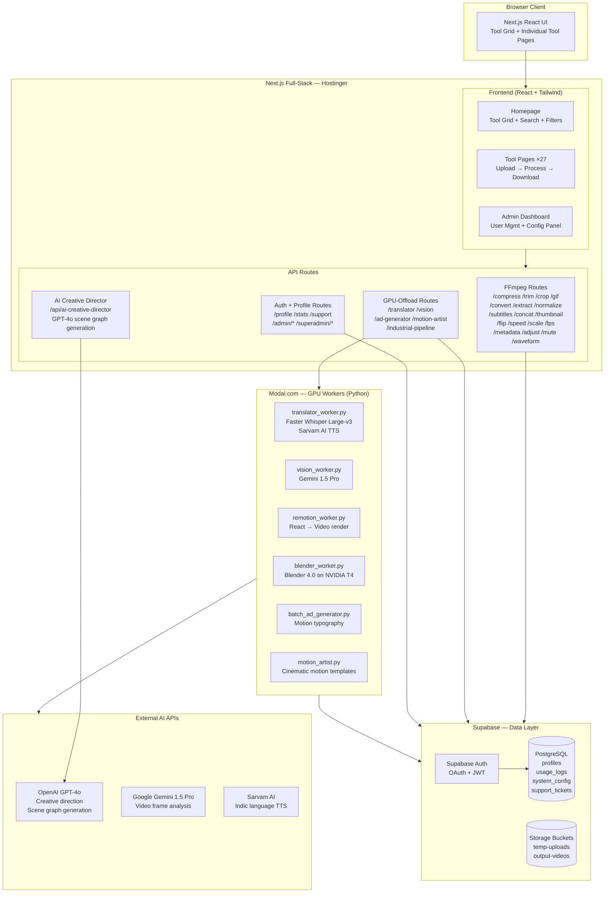

# System Design — Module31

## Architecture Overview

Module31 is a three-tier web application: a Next.js full-stack frontend/backend, a Supabase data layer, and a Modal.com GPU compute layer. The web tier is stateless — all state lives in Supabase; all heavy compute lives in Modal.



---

## Component Breakdown

### 1. Next.js Frontend

**Homepage (`/`)**
- Renders the `TOOLS` array as a searchable, filterable card grid
- Manages user auth state (Supabase session)
- Shows guest trial banner for unauthenticated users
- Displays credit balance in the navigation header
- Category filtering: All / Video / Audio / AI / Coming Soon

**Tool Pages (27 pages)**
- Each tool is an isolated `page.tsx` under `/app/<tool-name>/`
- All tool pages use `ToolPageWrapper` — handles guest trial tracking, signup gate modal, and watermark banner
- Pattern: file upload → form inputs (tool-specific) → submit → loading state → result URL → download button

**Admin Pages**
- `/admin` — user list, credit refill controls, support ticket view
- `/admin/config` — system config key/value editor with form validation

### 2. API Routes (Next.js)

**FFmpeg Routes (local processing)**
- Each route handles: multipart form upload → temp file write → FFmpeg command → output file write → return URL
- Uses `fluent-ffmpeg` Node.js wrapper with `ffmpeg-static` bundled binaries
- No external service call — processing happens in-process on the Next.js server
- Temp file cleanup: scheduled deletion after retention window

**GPU-Offload Routes**
- Writes input file to temp disk location
- Deducts credits from user profile (atomic DB operation)
- Shells out: `python -m modal run src/modal-workers/<worker>.py --input <path>`
- Waits for Modal worker to return output URL (synchronous in V2)
- Returns output URL to frontend

**AI Creative Director (`/api/ai-creative-director`)**
- Accepts text prompt from user
- Calls OpenAI GPT-4o with a structured system prompt
- Returns JSON "scene graph" (motion style, typography, timing, colors)
- Scene graph is consumed by Remotion/Blender workers for rendering

### 3. Supabase Data Layer

**Database Schema**

```
profiles
  user_id (FK → auth.users)
  email
  role: 'customer' | 'admin' | 'superadmin'
  credits: integer
  created_at

usage_logs
  id
  user_id (FK → profiles, nullable for guest)
  tool_name
  credits_used
  guest_mode: boolean
  status: 'success' | 'error'
  created_at

system_config
  key: string (unique)
  value: string
  updated_at

support_tickets
  id
  user_id (FK → profiles)
  message
  status: 'open' | 'resolved'
  created_at
```

**Row-Level Security**
- `profiles`: users can only read/update their own row
- `usage_logs`: users can only read their own logs; API service role writes
- `system_config`: readable by all authenticated; writable only by admin/superadmin role
- `support_tickets`: users read their own; admins read all

**Storage Buckets**
- `temp-uploads`: input files written by API routes; cleaned up after retention window
- `output-videos`: processed output files; time-limited public URLs returned to users

### 4. Modal.com GPU Workers

Each worker is a Python function decorated with `@modal.function()`:

| Worker | GPU | Libraries | Output |
|---|---|---|---|
| `translator_worker.py` | NVIDIA T4 | Faster Whisper, Sarvam AI, ffmpeg | Dubbed + translated video URL |
| `vision_worker.py` | NVIDIA T4 | Gemini 1.5 Pro API | JSON analysis + summary text |
| `remotion_worker.py` | NVIDIA T4 | Remotion, Node.js | Motion typography video URL |
| `blender_worker.py` | NVIDIA T4 | Blender 4.0, Python | 3D cinematic video URL |
| `batch_ad_generator.py` | NVIDIA T4 | Remotion, custom templates | Ad video URL |
| `motion_artist.py` | NVIDIA T4 | Blender, motion templates | Motion video URL |

**Worker lifecycle:**
1. Modal cold start: container launched, dependencies loaded (~10–30s if cold)
2. Input file downloaded from Supabase temp-uploads URL
3. Processing (Whisper ASR, Blender render, Remotion render, etc.)
4. Output uploaded to Supabase output-videos bucket
5. Output URL returned to Next.js API route
6. Container scales to zero (no idle cost)

---

## Data Flow: Standard Tool (FFmpeg)

```
User uploads file (multipart form)
  → Next.js API route receives stream
  → Validates file type and size
  → Writes to temp disk: /tmp/<uuid>-input.<ext>
  → Checks user credits (Supabase DB query)
  → Deducts credits (atomic UPDATE on profiles)
  → Logs usage (INSERT into usage_logs)
  → Runs FFmpeg command via fluent-ffmpeg
  → Writes output: /tmp/<uuid>-output.<ext>
  → Uploads output to Supabase Storage
  → Returns time-limited public URL
  → Schedules temp file deletion (retention window)
User downloads file from URL
```

## Data Flow: AI Tool (GPU)

```
User submits prompt / uploads file
  → Next.js API route
  → Validates input
  → Checks user credits (Supabase DB query)
  → Deducts credits BEFORE GPU invocation
  → Logs usage (INSERT into usage_logs)
  → Writes input to Supabase temp-uploads
  → Shells out: python -m modal run <worker> --input <supabase-url>
  → [Modal worker starts — cold start if needed]
  → Worker downloads input from Supabase
  → Worker processes (Whisper / Blender / Remotion)
  → Worker uploads output to Supabase output-videos
  → Worker returns output URL to Next.js
  → Next.js returns URL to frontend
User downloads output from URL
```

---

## Scaling Model

| Tier | Scaling Mechanism | Bottleneck |
|---|---|---|
| Frontend | Hostinger static/SSR — vertical scaling | Server RAM for concurrent uploads |
| FFmpeg routes | Stateless — scales with server capacity | Server CPU / disk I/O |
| Supabase | Managed PostgreSQL — auto-scales read replicas | Connection pool limits at high concurrency |
| Modal workers | Auto-scales to zero; new container per job | Cold start latency on GPU (10–30s) |
| External APIs | Managed by provider — rate limits apply | GPT-4o / Gemini API rate limits |

**Current bottleneck:** Synchronous Modal invocation in V2. Long renders (Blender 3D) can timeout the Next.js API route. Mitigated by: increased timeout configuration, progress messaging to user. **V3 fix:** async job queue with webhook callbacks.

---

## Security Model

| Concern | Mitigation |
|---|---|
| Unauthorized tool access | Supabase JWT validated on every API route |
| Credit manipulation | Credits deducted via server-side DB operation; no client-side trust |
| Guest trial abuse | Attempt count tracked server-side + localStorage dual-track |
| Admin privilege escalation | Role checked on every admin route; RLS enforces at DB level |
| File injection (malicious uploads) | File type validated by MIME type and extension; processed by FFmpeg (no exec of file contents) |
| Lingering user files | Auto-delete after retention window; no permanent storage of user content |
| API key exposure | No credentials in frontend code; all secrets in server-side env vars only |
